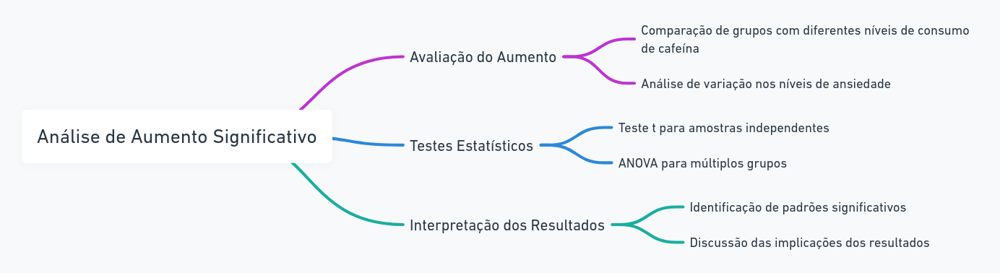

# Estudo do Efeito do Consumo de Cafeína na Ansiedade

### 1. **Problema/Situação:**
- Efeito do Consumo de Cafeína na Ansiedade
### 2. **Variáveis:**
- Quantidade de cafeína consumida por dia (numérica contínua)
- Nível de ansiedade (numérica ordinal, escala de 1 a 10)
### 3. **Apuração e Apresentação dos Dados:**
- Tabelas de distribuição de frequência para as variáveis "Quantidade de cafeína consumida por dia" e "Nível de ansiedade".
  
- Gráficos de dispersão para visualizar a relação entre a quantidade de cafeína e os níveis de ansiedade.
   
### 4. **Análise e Interpretação dos Dados:**
- Verificar a correlação entre o consumo de cafeína e o nível de ansiedade.
   
- Analisar se há um aumento significativo na ansiedade com o aumento do consumo de cafeína.
   

